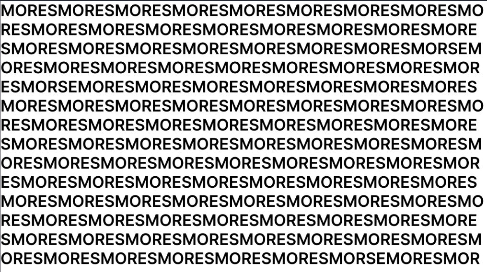
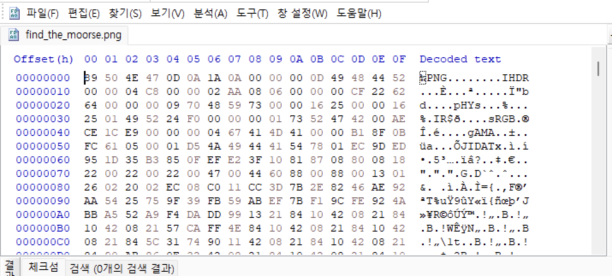
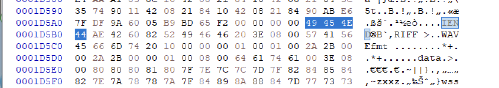
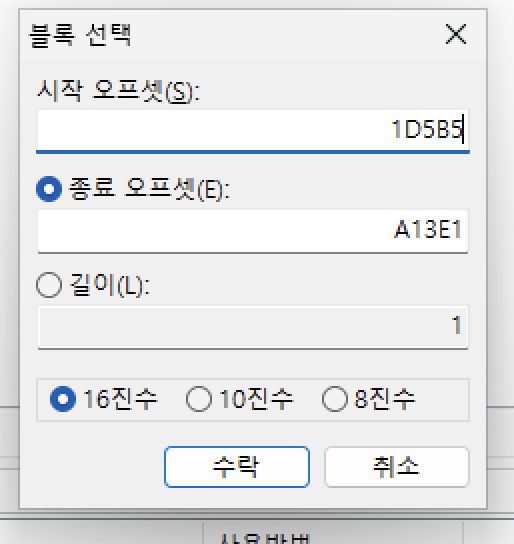
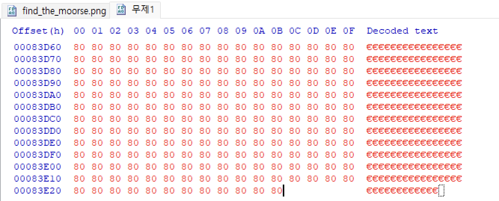
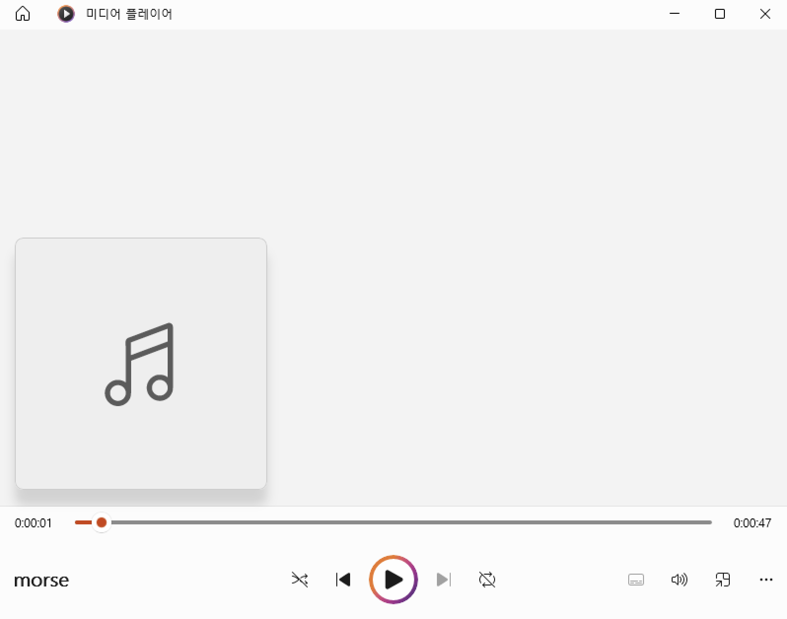
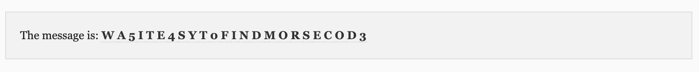

# find_the_morse

- 분야: forensics
- 키워드: morse code, HxD, file signature

## 배경

해당 문제는 주어진 PNG 파일을 분석하여 숨겨진 파일을 찾고 모스 부호를 해석하여 플래그를 획득하는 것이 목표입니다. 해당 문제를 통해 파일 시그니처를 분석해보고 모스 부호에 대해 학습할 수 있습니다.

## 분석

문제 파일을 열면 `MORES` 와 `MORSE` 가 섞여있는 문자가 가득 적힌 png 파일을 확인할 수 있습니다. 문제의 제목을 확인해보면, MORSE를 찾아라로 해석되지만, 단순히 화면에서 MORSE 문자열을 찾는 것이 문제 풀이는 아닙니다. 

HxD를 이용하여 파일의 헥스 값을 분석해보겠습니다.

파일의 헥스값은 각 파일의 시작을 알려주는 헤더 시그니처가 존재합니다. png 파일은 푸터 시그니처 또한 존재합니다. png 파일의 헤더 시그니처인 `89 50 4e 47 0d 0a 1a 0a`를 확인할 수 있습니다. 

png 파일의 푸터 시그니처인 `49 45 4e 44 ae 42 60 82`를 검색해 보면, 위와 같은 결과를 확인할 수 있습니다. 파일의 푸터 시그니처로 파일이 끝나는 것이 아닌, 뒤에 다른 헥스 값이 존재합니다. 다른 파일을 숨겨 놓은 것을 확인하고, 파일의 확장자를 알기 위해 파일의 헤더 시그니처를 분석합니다. 다음 파일의 파일 시그니처는 `52 46 49 49` 로 WAV 파일의 파일 시그니처입니다. 따라서 확장자를 `.wav` 으로 가지는 파일이 숨겨져 있습니다.

## 풀이

HxD의 블록선택 기능을 이용하여 png파일의 푸터 시그니처 다음 오프셋부터 마지막 오프셋까지 선택 후 복사합니다.

새로운 파일을 하나 만들어 붙여넣기 해주고, 파일의 확장자를 `.wav`으로 하여 저장합니다.

저장 후 오디오 파일을 확인할 수 있습니다. 재생해보면 반복적인 기계음 소리를 들을 수 있습니다. 문제의 제목에서 morse code라는 힌트를 주었으므로, audio morse code decode 웹 사이트를 이용하여 해석해주겠습니다. 

https://morsecode.world/international/decoder/audio-decoder-expert.html

파일을 업로드 후 디코드한 결과, 다음과 같은 문자열이 나왔습니다. 

문제의 description을 확인해보면 플래그 형식은 `ewha{[a-z0-9]*}` 이므로, 소문자로 바꾸어주고 ewha로 감싸주면 문제의 플레그를 얻을 수 있습니다.

플래그: ewha{wa5ite4syt0findmorsecod3}

## 레퍼런스

- http://forensic-proof.com/archives/300
- https://morsecode.world/international/decoder/audio-decoder-expert.html